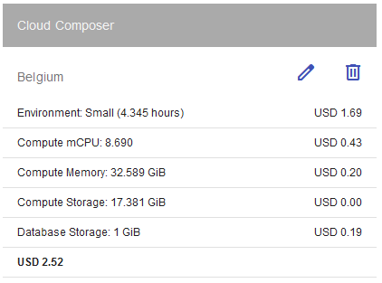
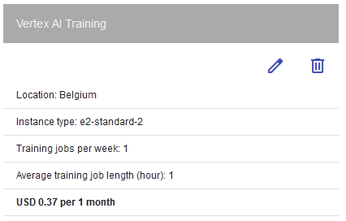
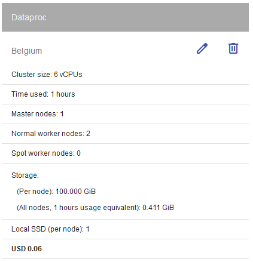
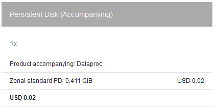
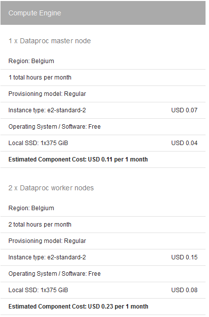

IMPORTANT ❗ ❗ ❗ Please remember to destroy all the resources after each work session. You can recreate infrastructure by creating new PR and merging it to master.
  


1. Authors:

   ***group nr 3***

   ***link to forked repo***
   
2. Fork https://github.com/bdg-tbd/tbd-2023z-phase1 and follow all steps in README.md.

3. Select your project and set budget alerts on 5%, 25%, 50%, 80% of 50$ (in cloud console -> billing -> budget & alerts -> create buget; unclick discounts and promotions&others while creating budget).

  

4. From avaialble Github Actions select and run destroy on main branch.

5. Create new git branch and add two resources in ```/modules/data-pipeline/main.tf```:
    1. resource "google_storage_bucket" "tbd-data-bucket" -> the bucket to store data. Set the following properties:
        * project  // look for variable in variables.tf
        * name  // look for variable in variables.tf
        * location // look for variable in variables.tf
        * uniform_bucket_level_access = false #tfsec:ignore:google-storage-enable-ubla
        * force_destroy               = true
        * public_access_prevention    = "enforced"
        * if checkcov returns error, add other properties if needed
       
    2. resource "google_storage_bucket_iam_member" "tbd-data-bucket-iam-editor" -> assign role storage.objectUser to data service account. Set the following properties:
        * bucket // refere to bucket name from tbd-data-bucket
        * role   // follow the instruction above
        * member = "serviceAccount:${var.data_service_account}"

    ***insert the link to the modified file and terraform snippet here***

    Create PR from this branch to **YOUR** master and merge it to make new release. 
    
    ***place the screenshot from GA after succesfull application of release with this changes***

    

6. Analyze terraform code. Play with terraform plan, terraform graph to investigate different modules.

    ***describe one selected module and put the output of terraform graph for this module here***
   
7. Reach YARN UI
   
   ***place the port and the screenshot of YARN UI here***
   
8. Draw an architecture diagram (e.g. in draw.io) that includes:
    1. VPC topology with service assignment to subnets
    2. Description of the components of service accounts
    3. List of buckets for disposal
    4. Description of network communication (ports, why it is necessary to specify the host for the driver) of Apache Spark running from Vertex AI Workbech
  
    ***place your diagram here***

9. Add costs by entering the expected consumption into Infracost

   ***place the expected consumption you entered here***

   ***place the screenshot from infracost output here***

10. Some resources are not supported by infracost yet. Estimate manually total costs of infrastructure based on pricing costs for region used in the project. Include costs of cloud composer, dataproc and AI vertex workbanch and them to infracost estimation.

    
    
    
    
    

    Data sourced from [GCP Cost Calculator](https://cloud.google.com/compute/all-pricing) with region set to `eu-west1`.

    Dataproc costs are per hour, the rest are per 4.345 hours (1h/1w/1m).

    The adjusted costs are:

    - composer: `2.52 / 4.345 = ~0.58`
    - vertex AI: `0.37 / 4.345 = ~0.09`
    - dataproc: `0.06`
    - dataproc disks: `0.02`
    - dataproc CE: `0.11 + 0.23 = 0.34`

    Which comes out to approximately 1.09 USD per hour. This assumes normal worker nodes for dataproc.

    [INSERT COSTS TALLIED WITH INFRACOST OUTPUT HERE]

    It is required that dataproc has at least one normal worker node, and all other nodes can be spot nodes. To this end, it is possible to optimize dataproc costs by changing all but one node types to spot, in our case making it 1 normal 1 spot worker, reducing the hourly cost from $0.34 to $0.27. The master node is always a normal node, and this cannot be optimized by means other than using a cheaper node type, e.g. a e2-highcpu which is cheaper, but comes with less RAM (2G instead of 8G).

    The overall cost optimization strategy would be to minimize runtime of all components or optimizing the amount of allocated storage to dataproc and composer instances. Further option is to automatically destroy all compute resources once a training session is over.
    
11. Create a BigQuery dataset and an external table
    
    ***place the code and output here***
   
    ***why does ORC not require a table schema?***
  
12. Start an interactive session from Vertex AI workbench (steps 7-9 in README):

    ***place the screenshot of notebook here***
   
13. Find and correct the error in spark-job.py

    ***describe the cause and how to find the error***

14. Additional tasks using Terraform:

    1. Add support for arbitrary machine types and worker nodes for a Dataproc cluster and JupyterLab instance

    ***place the link to the modified file and inserted terraform code***
    
    2. Add support for preemptible/spot instances in a Dataproc cluster

    ***place the link to the modified file and inserted terraform code***
    
    3. Perform additional hardening of Jupyterlab environment, i.e. disable sudo access and enable secure boot
    
    ***place the link to the modified file and inserted terraform code***

    4. (Optional) Get access to Apache Spark WebUI

    ***place the link to the modified file and inserted terraform code***
